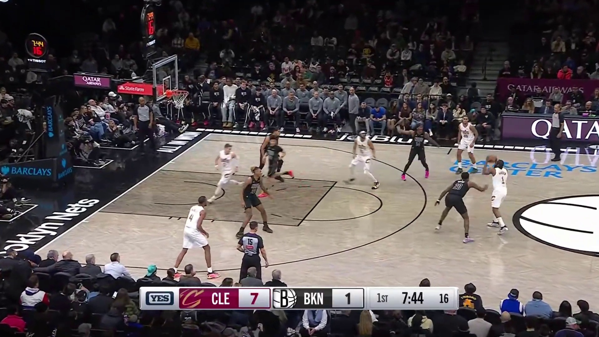
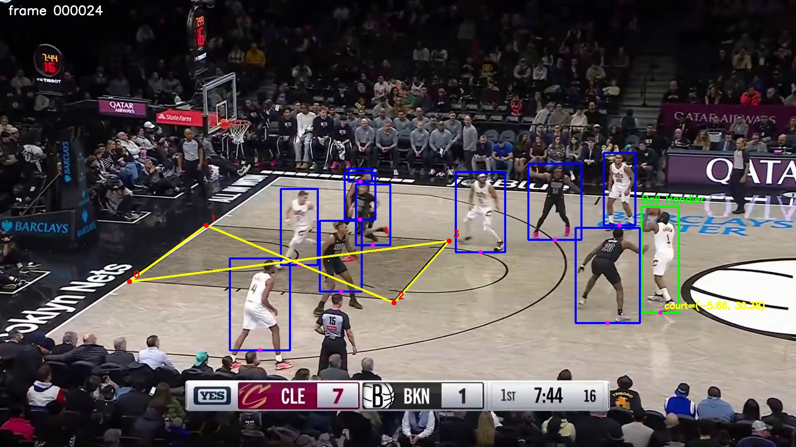

# NBA AI

Broadcast NBA frame/video pipeline for:

- player + ball detection
- ball-handler inference
- painted-area segmentation
- half-court homography fitting
- mapping the ball handler into top-down court coordinates

## Current State

The project currently works best as an inference pipeline over single frames, folders of frames, or video.

Main pieces:

- [detect.py](inference/detect.py): runs the player/ball detector
- [possession.py](inference/possession.py): picks the likely ball handler
- [paint_homography.py](inference/paint_homography.py): fits a homography from the painted area
- [run_frame.py](inference/run_frame.py): processes one frame
- [run_frames.py](inference/run_frames.py): processes a folder of frames
- [run_video.py](inference/run_video.py): processes a video and writes an overlayed output video
- [segment_paint_yolo.py](inference/segment_paint_yolo.py): standalone paint-seg + homography testing utility

## Models

This repo expects two trained models at inference time:

- a player/ball detector
- a paint segmentation model

The weight files are local artifacts and are not tracked in git, so you should pass your own paths when running inference.

## Coordinate System

The court coordinates are currently hoop-centered and based on the visible half-court paint.

The paint corners map to:

- left baseline lane corner: `(-8.0, -5.25)`
- right baseline lane corner: `(8.0, -5.25)`
- left free-throw lane corner: `(-8.0, 13.75)`
- right free-throw lane corner: `(8.0, 13.75)`

`player_foot_court_xy` is the detected ball handler's image-space foot point projected into that court coordinate system.

## Install

Requirements are minimal right now:

```bash
pip install -r requirements.txt
```

Current dependencies:

- `pandas`
- `opencv-python`
- `ultralytics`

## Run Inference

### Single Frame

```powershell
.\.venv\Scripts\python.exe inference\run_frame.py `
  --image ".\notebooks\test-frames\game5_0109.jpg" `
  --model "<path-to-player-ball-model.pt>" `
  --paint-model "<path-to-paint-seg-model.pt>" `
  --paint-basket-side left `
  --out_image ".\outputs\game5_0109.jpg"
```

Important output field:

```json
"possession": {
  "player_foot_court_xy": [-5.38, -1.29]
}
```

### Folder Of Frames

```powershell
.\.venv\Scripts\python.exe inference\run_frames.py `
  --source ".\notebooks\test-frames" `
  --model "<path-to-player-ball-model.pt>" `
  --paint-model "<path-to-paint-seg-model.pt>" `
  --paint-basket-side left `
  --output ".\runs\run-frames" `
  --save-overlays
```

Outputs:

- `runs/run-frames/json/*.json`
- `runs/run-frames/results.json`
- `runs/run-frames/overlays/*.jpg` if `--save-overlays` is set

### Video

```powershell
.\.venv\Scripts\python.exe inference\run_video.py `
  --video ".\runs\harden_to_allen.mp4" `
  --model "<path-to-player-ball-model.pt>" `
  --paint-model "<path-to-paint-seg-model.pt>" `
  --paint-basket-side left `
  --output ".\runs\run-video"
```

Outputs:

- `runs/run-video/results.json`
- `runs/run-video/json/frame_000000.json`, etc.
- `runs/run-video/harden_to_allen_overlay.mp4`

`--frame-step` is supported and preserves video timing in the overlay video by writing skipped frames through unchanged.

## Example: `harden_to_allen.mp4`

Tracked example assets:

- before video: [examples/harden_to_allen/harden_to_allen_before.mp4](examples/harden_to_allen/harden_to_allen_before.mp4)
- after video: [examples/harden_to_allen/harden_to_allen_after.mp4](examples/harden_to_allen/harden_to_allen_after.mp4)

| Before | After |
| --- | --- |
| [](examples/harden_to_allen/harden_to_allen_before.mp4) | [](examples/harden_to_allen/harden_to_allen_after.mp4) |

The counts below come from my most recent local run of `harden_to_allen.mp4`:

- `frames_seen`: `142`
- `frames_processed`: `142`
- `ball_detected`: `97`
- `possession_found`: `44`
- `court_xy_found`: `44`
- `paint_homography_available`: `142`

At the moment, that means:

- paint detection/homography is stable across the full clip
- possession is still the limiting stage
- court coordinates are only produced when possession returns a specific handler

## How The Pipeline Works

For each processed frame:

1. Detect players and ball.
2. Infer likely possession using ball-to-player proximity.
3. Segment the painted area.
4. Fit a paint homography from the predicted paint mask.
5. Estimate the handler foot as the bottom-center of the handler bbox.
6. Project that point into court coordinates.

## Current Limitations

- The player foot point is approximated as bbox bottom-center.
- If a player is truncated at the bottom of the frame, the inferred foot location can be wrong.
- Possession currently fails on some frames where the ball is in the air or the handler assignment is ambiguous.
- Paint homography is intentionally rejected when the paint is too close to the image border.
- Court coordinates are only as good as all upstream steps: detection, possession, paint segmentation, and homography.

The biggest current quality issue is player truncation near the bottom/bench-side edge, because that shifts the perceived foot position.

## Annotation Notes

Paint segmentation:

- one class: `paint`
- YOLO segmentation format
- dataset lives in `datasets/paint-seg`

Player detection:

- better labeling is likely the next highest-value improvement

## Near-Term Roadmap

- improve player detection labels and retrain
- improve handler foot-point quality for truncated players
- add jersey-number reading and player identity matching from a known on-court player list
- eventually aggregate identity across multiple frames instead of single-frame guesses

## Repo Notes

This repo is still in active experimentation mode. The README reflects the current working path.
